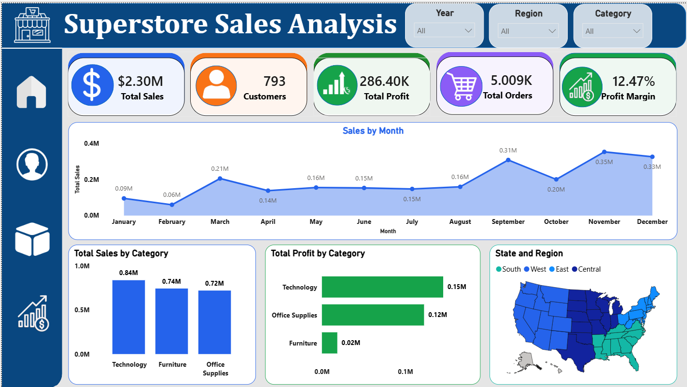
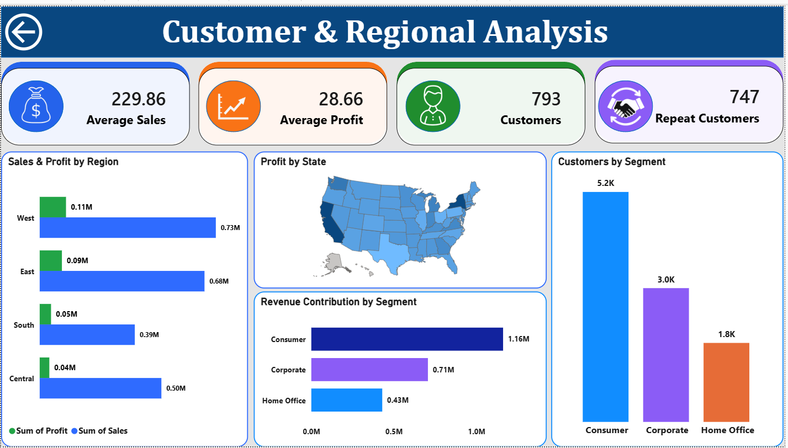
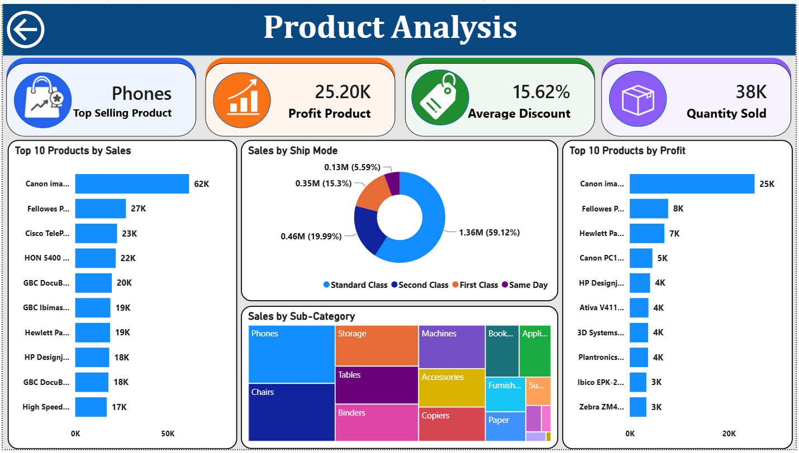
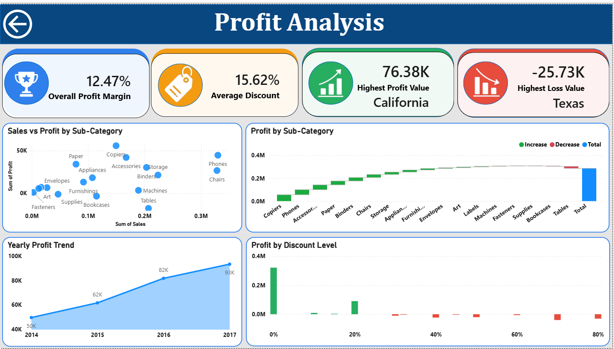

# Superstore Sales Analysis Dashboard

> A professional **Power BI Dashboard Project** built using the **Sample Superstore Dataset**. This dashboard provides comprehensive insights into sales, profit, customer behavior, regional performance, and product analysis through interactive visualizations.

---

## Project Overview

The **Superstore Sales Analysis Dashboard** is designed to help business stakeholders monitor sales performance, identify profitable products, understand customer segments, and evaluate regional trends. The dashboard contains **4 interactive report pages** with slicers, KPIs, maps, and various charts for detailed business analysis.

---
# Dashboard Preview

## Executive Sales Overview



---

## Customer & Regional Analysis



---

## Product Analysis



---

## Profit Analysis



---

## Project Objectives

- Analyze overall sales and profitability.
- Monitor monthly sales trends.
- Identify top-selling and most profitable products.
- Understand customer purchasing behavior.
- Compare regional and state-wise performance.
- Evaluate discount impact on profit.
- Support data-driven business decisions.

---

## Tools & Technologies

- **Power BI Desktop**
- **Power Query**
- **DAX (Data Analysis Expressions)**
- **Sample Superstore Dataset**
- **Data Modeling**
- **Interactive Visualizations**

---

## Dataset Information

The dataset contains retail sales transactions including:

- Order ID
- Order Date
- Ship Date
- Customer Name
- Segment
- Region
- State
- Category
- Sub-Category
- Product Name
- Sales
- Profit
- Quantity
- Discount
- Ship Mode

---

# Dashboard Pages

---

# Page 1 – Executive Sales Overview

## KPIs

- 💰 Total Sales
- 👥 Total Customers
- 📈 Total Profit
- 🛒 Total Orders
- 📊 Profit Margin

## Visualizations

- Monthly Sales Trend (Area Chart)
- Sales by Category
- Profit by Category
- Region-wise Sales Map

## Business Insights

- Monitor overall business performance.
- Identify monthly sales trends.
- Compare category performance.
- Analyze geographical sales distribution.

---

# Page 2 – Customer & Regional Analysis

## KPIs

- Average Sales
- Average Profit
- Total Customers
- Repeat Customers

## Visualizations

- Sales vs Profit by Region
- Profit by State (Filled Map)
- Revenue Contribution by Segment
- Customers by Segment

## Business Insights

- Identify high-value customer segments.
- Compare regional sales and profits.
- Analyze repeat customer performance.
- Understand customer distribution.

---

# Page 3 – Product Analysis

## KPIs

- Top Selling Product
- Most Profitable Product
- Average Discount
- Quantity Sold

## Visualizations

- Top 10 Products by Sales
- Top 10 Products by Profit
- Sales by Ship Mode
- Sales by Sub-Category (Treemap)

## Business Insights

- Identify best-selling products.
- Compare profitable products.
- Analyze shipping preferences.
- Understand sub-category contribution.

---

# Page 4 – Profit Analysis

## KPIs

- Overall Profit Margin
- Average Discount
- Highest Profit State
- Highest Loss State

## Visualizations

- Sales vs Profit by Sub-Category
- Profit Waterfall Chart
- Yearly Profit Trend
- Profit by Discount Level

## Business Insights

- Analyze profit contribution.
- Detect loss-making categories.
- Evaluate yearly profit growth.
- Understand the impact of discounts on profitability.

---

# Key Performance Indicators (KPIs)

- Total Sales
- Total Profit
- Total Orders
- Total Customers
- Profit Margin
- Average Sales
- Average Profit
- Repeat Customers
- Quantity Sold
- Average Discount

---

# DAX Measures Used

Some of the DAX measures created include:

- Total Sales
- Total Profit
- Profit Margin %
- Total Orders
- Total Customers
- Average Sales
- Average Profit
- Repeat Customers
- Quantity Sold
- Top Selling Product
- Most Profitable Product
- Highest Profit State
- Highest Loss State

---

# Dashboard Features

- Interactive Slicers
- Cross Filtering
- Drill-down Analysis
- Dynamic KPIs
- Responsive Layout
- Navigation Buttons
- Filled Maps
- Treemap
- Waterfall Chart
- Area Chart
- Bar Charts
- Donut Chart
- Scatter Plot

---


# Key Insights

- Technology is the highest revenue-generating category.
- Consumer segment contributes the largest share of revenue.
- Standard Class is the most frequently used shipping mode.
- California delivers the highest profit.
- Texas records the highest loss.
- Phones are the top-selling products.
- Profit consistently increased over the years.
- Higher discounts significantly reduce profitability.

---

# Dashboard Preview

## Executive Dashboard
- Overall business KPIs
- Monthly sales trend
- Category performance
- Regional sales map

## Customer Dashboard
- Customer segmentation
- Regional profit analysis
- State-wise profit map

## Product Dashboard
- Product performance
- Ship mode analysis
- Top 10 products
- Sub-category treemap

## Profit Dashboard
- Profit trends
- Discount analysis
- Waterfall chart
- Scatter analysis

---

# Skills Demonstrated

- Power BI Dashboard Development
- Data Cleaning
- Power Query
- Data Modeling
- DAX
- Business Intelligence
- Data Visualization
- KPI Design
- Interactive Reporting
- Analytical Thinking

---

# Conclusion

This dashboard transforms raw retail transaction data into meaningful business insights. It enables decision-makers to monitor performance, identify growth opportunities, optimize product strategies, improve customer understanding, and enhance overall profitability through interactive and visually appealing reports.

---

## 👨‍💻 Author

**Al Thameez S**


---
```
